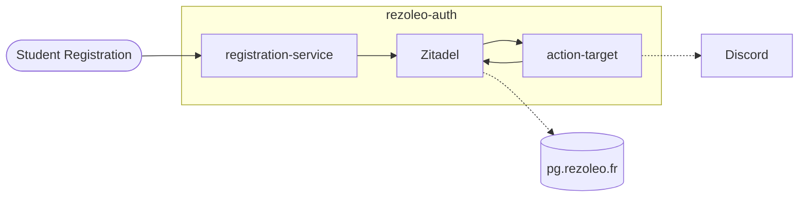

# Rézoléo Auth

SSO infrastructure for [Rézoléo](https://rezoleo.fr/) using [Zitadel](https://zitadel.com/).

## What is this?

This project manages centralized authentication for Rézoléo services. It consists of:

1. **Zitadel** - Open-source identity provider (IdP) handling OAuth2/OIDC flows
2. **Registration Service** - Custom FastAPI app for student onboarding
3. **Action Target** - Custom FastAPI webhook service
   for [Zitadel Actions V2](https://zitadel.com/docs/concepts/features/actions_v2) (e.g. for validation)

## Architecture



### Registration Service (`registration-service/`)

Web interface for students to create accounts with their school email.

**Key features:**

- Validates `prenom.nom@{centrale|enscl|iteem|ig2i}.centralelille.fr` emails
- Auto-generates unique usernames (e.g., `jean-dupont`, `jean-dupont-1`)
- Creates users in Zitadel via Rézoléo machine account
- Serves static frontend (HTML/JS form)

**Example flow:**

```python
# POST /register
{
    "email": "jean.paul@centrale.centralelille.fr",
    "first_name": "Jean-Paul",
    "last_name": "Dupont"
}

# → Creates user with:
# - username: jean-paul-dupont
# - school metadata: centrale
```

Zitadel then automatically sends verification email (could be customized).

**Key files:**

- `backend/main.py` - FastAPI endpoints
- `backend/zitadel_client.py` - Zitadel API wrapper
- `backend/utils.py` - Email parsing, username sanitization
- `frontend/` - Registration HTML form

### Action Target (`action-target/`)

FastAPI webhook receiver for [Zitadel Actions V2](https://zitadel.com/docs/concepts/features/actions_v2) (event
triggers).

**Implemented actions:**

1. **`/on-user-created`** - Sends notification when new user registers
2. **`/on-user-updated`** - Blocks username changes by non-admins, validates username format
3. **`/on-userinfo`** - Enriches OIDC userinfo with project-specific roles

**Example: Role injection**

```python
# Zitadel user grants:
# - Project "REZOLEO": roles ["admin", "rezoleo"]

# → OIDC claims:
{
    "roles-REZOLEO": ["admin", "member"]
}
```

## Development Setup

### Prerequisites

- Docker & Docker Compose
- PostgreSQL (external, configured in `.env`)
- Python 3.13+ (for local development)

### Configuration

Create `.env` from `.env.example`:

```bash
POSTGRES_ADMIN_PASSWORD=...
ADMIN_ACCOUNT_PASSWORD=...
ZITADEL_REZOLEO_PAT=...
DISCORD_WEBHOOK_URL=...
```

Generate `master.key` for Zitadel:

```bash
openssl rand -base64 32 > master.key
```

### Run

```bash
docker-compose up -d
```

Services:

- Zitadel: http://localhost:8080
- Registration: http://localhost:8000
- Action Target: http://localhost:8001

### Local Development

**Registration service:**

```bash
cd registration-service
uv venv --python 3.13 && source .venv/bin/activate
uv pip install -r requirements.txt
uvicorn backend.main:app --reload --port 8000
```

**Action target:**

```bash
cd action-target
uv venv --python 3.13 && source .venv/bin/activate
uv pip install -r requirements.txt
uvicorn app.main:app --reload --port 8001
```

## Zitadel Integration

### APIs V2

The registration service uses [Zitadel's v2 API](https://zitadel.com/docs/apis/v2):

- `POST /v2/users` - Search users (by email/username)
- `POST /v2/users/new` - Create human user with metadata

**Auth:** Personal Access Token (PAT) for Rézoléo machine user.

### Actions V2 (Webhooks)

Configure in [Zitadel Default Settings](https://sso.rezoleo.fr/ui/console/instance):

| Condition                                              | Type     | Target                                      |
|--------------------------------------------------------|----------|---------------------------------------------|
| `method: /zitadel.user.v2.UserService/CreateUser`      | Response | `http://action-target:8001/on-user-created` |
| `method: /zitadel.user.v2.UserService/UpdateHumanUser` | Request  | `http://action-target:8001/on-user-updated` |
| `funtion: preuserinfo`                                 | Function | `http://action-target:8001/on-userinfo`     |

Be careful when you set up targets to take responses into account by selecting the right *Type* in the target
configuration.

## Key Decisions

- **Why Zitadel?** Open-source, self-hosted, standards-compliant (OAuth2/OIDC), extensible via Actions V2
- **Email-based registration:** School emails enforce .centralelille.fr domain, auto-extract school affiliation
- **Username format:** Unix-like (`[a-z][a-z0-9_-]{0,30}`), collision-resistant with numeric suffixes
- **Role claims:** Custom `roles-{project}` format allows multi-tenant authorization

## Security Notes

- Registration endpoint is public
- Username changes blocked for non-admin users

## Authors

- David Marembert - [GitHub](https://github.com/D0gmaDev)
